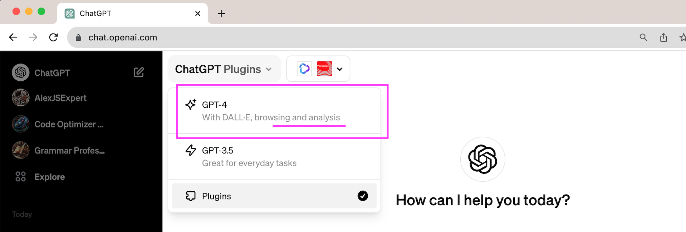

# ChatGPT : Développer avec le plug-in Advanced Data Analysis

Ce dossier Repository est lié au cours `ChatGPT : Développer avec le plug-in Advanced Data Analysis`. Le cours entier est disponible sur [LinkedIn Learning][lil-course-url].

![Nom final de la formation][lil-thumbnail-url]

Ce cours est intégré à GitHub Codespaces, un environnement de développement instantané « dans le nuage » qui offre toutes les fonctionnalités de votre IDE préféré sans nécessiter de configuration sur une machine locale. Avec Codespaces, vous pouvez vous exercer à partir de n'importe quelle machine, à tout moment, tout en utilisant un outil que vous êtes susceptible de rencontrer sur votre lieu de travail. Consultez la vidéo "Utilisation de Codespaces GitHub dans le cadre de ce cours" pour savoir comment démarrer.

Avec Sandy Ludosky, apprenez à utiliser le plug-in Advanced Data Analysis de ChatGPT pour développer des applications et des jeux vidéo. Après une introduction à ChatGPT et à ses capacités, vous vous servirez de ses fonctionnalités avancées, notamment pour générer et visualiser des données, télécharger et manipuler des fichiers, et apprendre le prompt engineering et les bonnes pratiques. Puis, après un exercice pratique sous forme de défi, vous passerez à la réalisation d'un jeu d'arcade, notamment en préparant les instructions pour l'IA, en téléchargeant les ressources graphiques et en générant le code source pour finaliser le jeu.

## Instructions

Ce dossier Repository a des branches pour chacune des vidéos du cours. Vous pouvez utiliser le menu des Branches sur GitHub afin d’accéder aux passages qui vous intéressent. Vous pouvez également rajouter `/tree/BRANCH_NAME` à l’URL afin d’accéder à la branche qui vous intéresse.

**Depuis le 06 novembre 2023, les plugins (dont ADA) sont désormais regroupés et accessibles depuis le même menu déroulant**

## Branches

Les branches sont structurées de manière à correspondre aux vidéos du cours. La convention de nommage est : `CHAPITRE#_VIDEO#`. Par exemple, la branche nommée`02_03` correspond au second chapitre, et à la troisième vidéo de ce chapitre. Certaines branches ont un état de départ et de fin.
La branche `02_03_d` correspond au code du début de la vidéo.
La branche `02_03_f` correspond au code à la fin de la vidéo.
La branche master correspond au code à la fin de la formation.

### Formateur

**Sandy Ludosky**

 Retrouvez mes autres formations sur [LinkedIn Learning][lil-URL-trainer].

[0]: # (Replace these placeholder URLs with actual course URLs)
[lil-course-url]: https://www.linkedin.com/learning/chatgpt-developper-avec-le-plug-in-advanced-data-analysis
[lil-thumbnail-url]: https://media.licdn.com/dms/image/D4E0DAQENZKcHPYD5dA/learning-public-crop_675_1200/0/1699858084845?e=2147483647&v=beta&t=Iiupi40MNnhD7HKq9OVggmkewHUBG0-QCGrKIwIDyjE
[lil-URL-trainer]: [https://](https://www.linkedin.com/learning/instructors/sandy-ludosky)

[1]: # (End of FR-Instruction ###############################################################################################)
